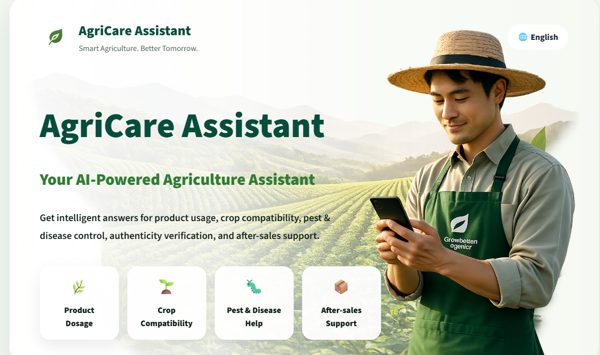

# -AgriCare-Assistant
A production-oriented RAG assistant built around real agricultural product data and company support knowledge.

```markdown


<p align="center">
  
</p>

<p align="center">
  <strong>From product catalogs and support conversations to one reliable support layer.</strong>
</p>

AgriCare Assistant is a client-built knowledge assistant developed for a China-based agricultural company using real, client-provided data.

The system brings product information and company support knowledge into a single interface designed to handle practical agricultural and customer-service questions.

This is not a generic chatbot built on public datasets. The retrieval pipeline, routing logic, product matching, and response generation were designed around the client's actual data and support scenarios.

---

## What It Does

AgriCare Assistant is designed to handle different support scenarios through a routed retrieval pipeline rather than treating every question the same way.

### Product & Dosage

Answers questions related to:

- Product information
- Product usage
- Dosage and application
- Water mixing ratios
- Ingredients
- Product specifications

### Crop Compatibility

Supports questions related to:

- Applicable crops
- Plant compatibility
- Crop-specific applications
- Recommended usage contexts

### Pest & Disease

Supports questions related to:

- Pest control
- Disease-related symptoms
- Product recommendations
- Diagnosis-oriented support

### After-sales Support

Handles customer-support scenarios such as:

- Orders
- Shipping and delivery
- Returns and refunds
- Tracking
- Payments
- Damaged or missing products

---

## The Idea Behind the System

Agricultural support questions are rarely the same problem.

A dosage question should be grounded in product documentation.

A crop compatibility question requires crop-specific information.

A disease-related question may depend on both product knowledge and support conversations.

An after-sales question belongs to a completely different knowledge source.

Instead of sending every question into one vector search, AgriCare Assistant first determines what the user is asking and then selects the most appropriate knowledge source.

```text
User Question
      │
      ▼
Intent Detection
      │
      ├── Product / Dosage
      ├── Crop Compatibility
      ├── Pest & Disease
      ├── Safety
      ├── Authenticity
      ├── After-sales
      └── Other / Clarification
      │
      ▼
Source Routing
      │
      ├── Product Catalog
      └── Company Support Conversations
      │
      ▼
Semantic Retrieval
      │
      ▼
Product Matching + Metadata Filtering
      │
      ▼
Source-aware Reranking
      │
      ▼
Context Construction
      │
      ▼
Grounded Response + Citations
```

---

## Data

The system was built using **proprietary data supplied directly by the client**, a China-based agricultural company.

The knowledge base is organized around two main sources.

### Product Catalog

Structured product information covering areas such as:

- Product overview
- Ingredients
- Applicable crops and plants
- Dosage and application
- Water mixing ratio
- Product specifications
- Safety-related information

### Company Support Conversations

Real company conversation data used to capture practical support knowledge and customer-service scenarios, including:

- Product usage
- Diagnosis
- Safety
- Product recommendations
- Crop compatibility
- After-sales support

The original client data is **not included in this repository**.

---

## Retrieval Architecture

The system uses separate knowledge collections for product information and company support conversations.

```text
                    ┌─────────────────────┐
                    │    User Question    │
                    └──────────┬──────────┘
                               │
                               ▼
                    ┌─────────────────────┐
                    │   Intent Detection  │
                    └──────────┬──────────┘
                               │
                 ┌─────────────┴─────────────┐
                 ▼                           ▼
        ┌──────────────────┐       ┌──────────────────┐
        │ Product Catalog  │       │ Company Support  │
        │    Collection    │       │    Collection    │
        └────────┬─────────┘       └────────┬─────────┘
                 │                          │
                 └────────────┬─────────────┘
                              ▼
                    ┌─────────────────────┐
                    │ Candidate Retrieval │
                    └──────────┬──────────┘
                               ▼
                    ┌─────────────────────┐
                    │ Product Matching    │
                    │ Metadata Filtering  │
                    │ Source Reranking    │
                    └──────────┬──────────┘
                               ▼
                    ┌─────────────────────┐
                    │ Grounded Generation │
                    └─────────────────────┘
```

Keeping the knowledge sources separate allows the system to apply different retrieval strategies depending on the user's intent.

---

## Core Retrieval Features

### Intent-based Routing

Incoming questions are classified before retrieval.

Different intents can use different retrieval strategies and preferred knowledge sections.

| Intent | Preferred Knowledge |
|---|---|
| Dosage | Dosage & Application / Water Mixing Ratio |
| Ingredient | Ingredients |
| Crop Compatibility | Applicable Crops & Plants |
| Product Usage | Product Information + Dosage |
| Diagnosis | Product Information + Support Knowledge |
| Safety | Product Documentation + Support Knowledge |
| Authenticity | Product Specifications |
| After-sales | Company Support Conversations |

### Exact Product Matching

When a user explicitly mentions a product, the system attempts to identify the corresponding product before final retrieval.

This helps prevent a common RAG failure mode: retrieving semantically similar information about the wrong product.

### Metadata-aware Retrieval

Retrieval is not based on embeddings alone.

Retrieved candidates can also be influenced by metadata such as:

- Product name
- Source type
- Chat category
- Document section
- Intent

This allows the system to prioritize evidence that is relevant to the current question.

### Source-aware Reranking

Initial vector retrieval produces candidate chunks.

The candidates are then reranked using semantic similarity together with domain-specific signals, improving the likelihood that the final context contains the information needed to answer the question.

### Clarification Guard

The system does not blindly retrieve whenever a question is ambiguous.

When a product-specific question does not contain enough information to determine which product is being discussed, the system can request clarification instead of confidently returning unrelated information.

This is particularly important for dosage, compatibility, and safety questions.

### Grounded Answers

The generation layer is designed to:

- Use retrieved context for factual claims
- Prefer product information for product-specific facts
- Prefer company support knowledge for support procedures
- Avoid inventing dosage or application ratios
- Avoid inventing crop compatibility
- Avoid inventing ingredients or safety information
- State when the available context is insufficient
- Provide citations for retrieved claims

The goal is simple:

> **If the knowledge base does not support an answer, the system should not manufacture one.**

---

## Technology

### Retrieval & Storage

- ChromaDB
- OpenAI Embeddings
- Metadata-based filtering
- Custom reranking logic

### LLM Layer

- OpenAI API
- GPT-based generation
- Structured prompting
- LLM-as-a-judge evaluation

### Data Processing

- Python
- Pandas
- NumPy

---

## Project Structure

```text
AgriCare-Assistant/
│
├── notebooks/
│   ├── agri_rag_step1.ipynb
│   ├── agri_rag_step2.ipynb
│   └── agri_rag_step3.ipynb
│
├── assets/
│   └── agricare-assistant.png
│
├── README.md
└── .gitignore
```

---

## Development

The system was developed in three main stages.

### Step 1 — Knowledge Preparation

Client-provided data was cleaned, transformed into retrieval-ready chunks, and enriched with metadata.

### Step 2 — Retrieval System

The initial retrieval layer was extended into a routed dual-source system with:

- Separate Chroma collections
- Intent detection
- Product matching
- Routing rules
- Metadata filtering
- Reranking
- Citation handling
- Clarification logic

### Step 3 — Evaluation & Refinement

The retrieval and generation pipeline was evaluated internally using a private benchmark based on client-provided data.

The evaluation process was used to compare different retrieval configurations and refine the final system.

---

## Evaluation & Privacy

The system was evaluated using a **private benchmark derived from client-provided data**.

Evaluation datasets, raw benchmark results, company conversations, transcripts, and other proprietary materials are intentionally excluded from this repository to protect client confidentiality.

The public repository focuses on the **engineering approach, retrieval architecture, and system implementation** rather than exposing the client's private knowledge base.

---

## Client Context

This project was developed as a **client project for a China-based agricultural company** using real company-provided data.

Because the underlying product catalog and support conversations contain proprietary information, the original datasets and sensitive company content are not published in this repository.

The project therefore demonstrates the engineering work behind building a domain-specific RAG system while respecting the confidentiality of the client's data.

---

## What Makes It Different

The interesting part of this system is not simply adding an LLM to agricultural documents.

The real challenge was deciding:

> **What should be retrieved, from where, and under what conditions?**

A dosage question, a disease question, and a refund request may all arrive through the same chat interface — but they should not be treated as the same retrieval problem.

AgriCare Assistant was built around that idea:

**Route first. Retrieve with intent. Rerank with context. Answer from evidence.**

---

## Privacy Notice

This repository does not contain:

- Client datasets
- Private support conversations
- Customer information
- Credentials or API keys
- Proprietary vector stores
- Private evaluation datasets
- Raw evaluation results containing client-derived content

Any publicly available examples are non-sensitive representations of the system.

---

## Status

**Client Project — Completed**
```
